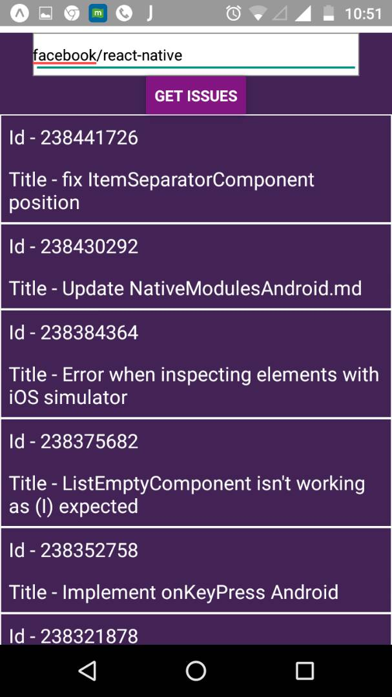
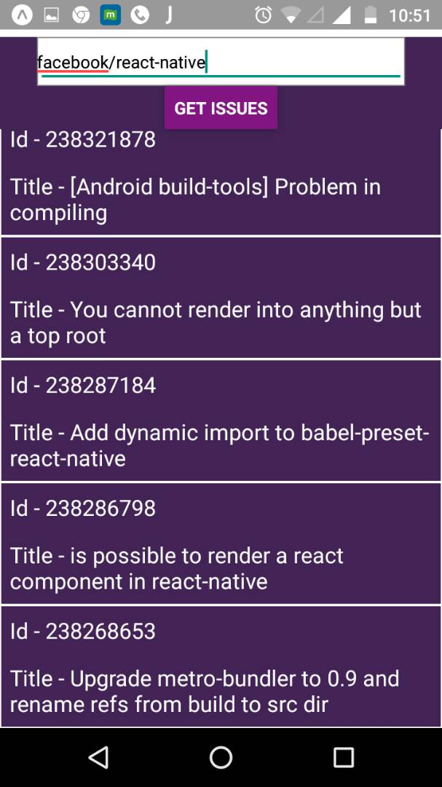

# Github-Issue-Finder
A React-Native application which finds issues of a particular Github Repository

Screenshots 

1

2

3

4

Subtasks -

* Install nodejs - Done
* Install react-native - Done
* Install exponent - Done
* Run first basic app - Done
* Setup github repository - Done
* Learn react-native from official documentation - Done
* Create a nodejs server project - Remained ( Skipper two tier architecture )
* Change png files for the project - Remained
* Build android apk and run it on mobile device - Done
* Read about the github api - Done
* Installed genymotion - Done
* Installed virtual box - Done
* Watch tutorials on flex basics and layout - Done
* Read about redux, redux patterns - Done
* Validations - Remained
* Pagination - Remained
* Layout enhancement - Remained
* Loading Icon - Remained 
* Write test cases - Remained
* Documentation of code - Remained 
* Implement ESLint, JShint - Remained   

