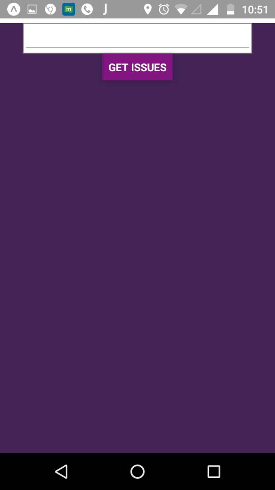
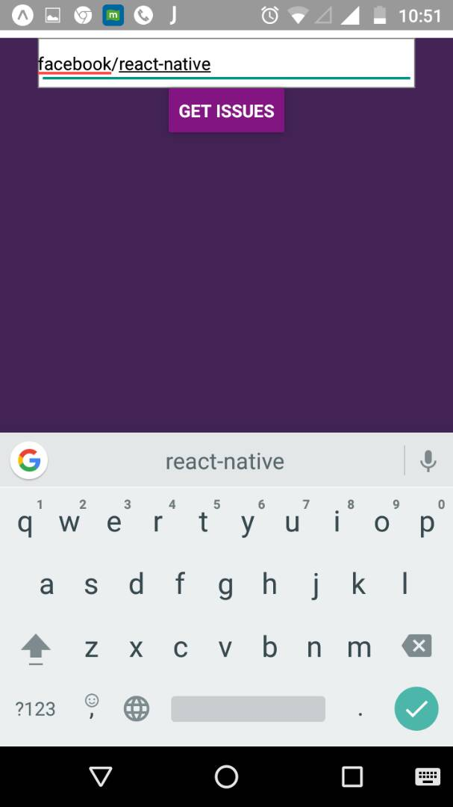

# Github-Issue-Finder
A React-Native application which finds issues of a particular Github Repository

Screenshots 

Subtasks -

* Install nodejs - Done
* Install react-native - Done
* Install exponent - Done
* Run first basic app - Done
* Setup github repository - Done
* Learn react-native from official documentation - Done
* Create a nodejs server project - Remained ( Skipper two tier architecture )
* Change png files for the project - Remained
* Build android apk and run it on mobile device - Done
* Read about the github api - Done
* Installed genymotion - Done
* Installed virtual box - Done
* Watch tutorials on flex basics and layout - Done
* Read about redux, redux patterns - Done
* Validations - Remained
* Pagination - Remained
* Layout enhancement - Remained
* Loading Icon - Remained 
* Write test cases - Remained
* Documentation of code - Remained 
* Implement ESLint, JShint - Remained   

Steps to Run Application 

npm install react-native -g
npm install react -g
npm install exp -g 
git clone https://github.com/upa8/Github-Issue-Finder.git
npm install 
Download Genymotion for personal use from genymotion website 
Download virtual box ( It's dependancy for geny motion )
Download Android studio, and install it ( It will install sdk for you )
Set path ANDROID_HOME in environment varibale to sdk location 
Try running following command from command prompt 
adb 

if it says that command is not found then go to you sdk, find a folder platform-tools. 
Put this path in envrionment variable called PATH

Now everything is setup. 

Now run Genymotion, create a device in it. Go to genymotion setting option, 
select adb. Set sdk path there. 

now Run the genymotion device 

run following command to start the exp app in genymotion device 

exp start --dev --exp

This will start the exponent server, once it's complete. 
Then run following command to run the app in genymotion

exp android 

I know this are pretty vauge steps, I will add detail steps with screenshot this weekend. 
I don't get time on weekdays. If you get stuck at any point, just give me a call. 

Thanks

